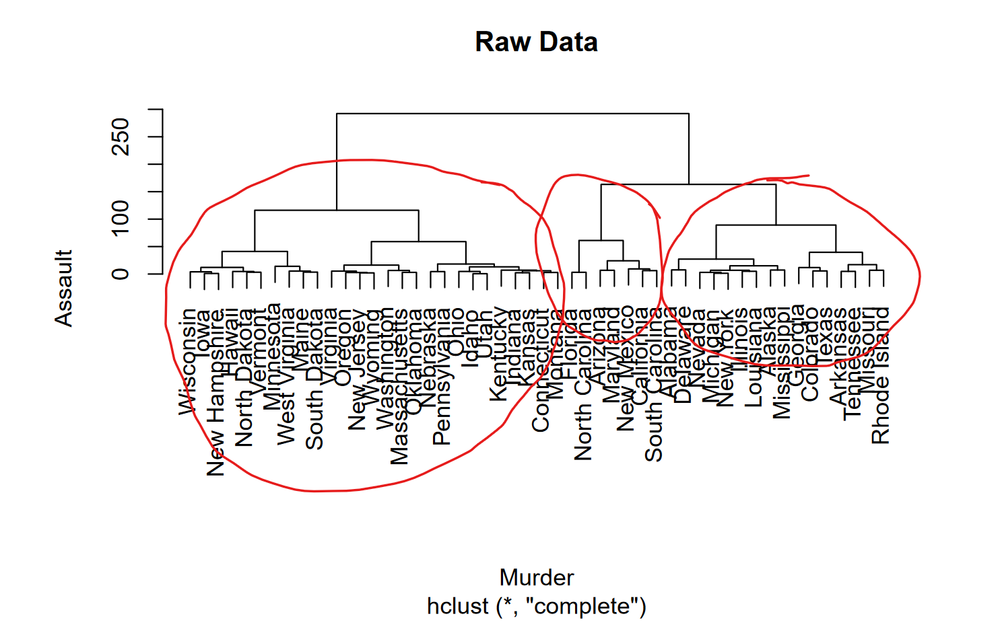

```{r setup, include=FALSE}
knitr::opts_chunk$set(echo = TRUE)
```

## Exercise 8

In Section 10.2.3, a formula for calculating PVE was given in Equation
10.8. We also saw that the PVE can be obtained using the sdev output of
the prcomp() function. On the USArrests data, calculate PVE in two ways:

  a. Using the sdev output of the prcomp() function, as was done in
Section 10.2.3.

```{r}
#load data
#install.packages('ISLR') #note: may need to install.packages in the console!
library(ISLR)
data("USArrests")

# Note: The variance explained by each principal component:
# pr.var = pr.out$sdev^2

pr.out = prcomp(USArrests, scale = TRUE)
pve =100*pr.out$sdev^2 / sum(pr.out$sdev^2)
pve
```

  b. By applying Equation 10.8 directly. That is, use the
prcomp() function to compute the principal component loadings. Then, use
those loadings in Equation 10.8 to obtain the PVE. These two approaches
should give the same results.

Hint: You will only obtain the same results in (a) and (b) if the same
data is used in both cases. For instance, if in (a) you performed
prcomp() using centered and scaled variables, then you must center and
scale the variables before applying Equation 10.3 in (b).


```{r}

```

## Exercise 9

Consider the USArrests data. We will now perform hierarchical clustering on the states.

  a. Using hierarchical clustering with complete linkage and
Euclidean distance, cluster the states.

```{r}
#cluster analysis with complete linkage
d = dist(USArrests, method="euclidean") #hclust requires distance
hc = hclust(d, method="complete") #use complete linkage
#plot
plot(hc,ylab="Assault", xlab="Murder",
main="Raw Data")
```

  b. Cut the dendrogram at a height that results in three distinct
clusters. Which states belong to which clusters?

```{r}
arrests_hclust = cutree(hc, k = 3)
arrests_hclust

arrests_hclust = cutree(hc, k = 3) -> cluster_a
table(cluster_a)
```


  c. Hierarchically cluster the states using complete linkage and Eu-
clidean distance, after scaling the variables to have standard de-
viation one.

```{r}
#scale variables to have standard deviation one
df = scale(USArrests)
#cluster analysis with complete linkage
d = dist(df, method="euclidean") #hclust requires dist.
hc = hclust(d, method="complete") #use complete linkage
#plot
plot(hc,ylab="Assault", xlab="Murder",
main="Raw Data")
```

  d. What effect does scaling the variables have on the hierarchical
clustering obtained? In your opinion, should the variables be
scaled before the inter-observation dissimilarities are computed?
Provide a justification for your answer.

\textcolor{red}{The scaling appears to increase the dissimilarity (in a relative sense) of the observations, as the linkages are higher up in the dendrogram. The variables should be scaled as the UrbanPop variable is in different units to the other variables.}

## Exercise 2

Suppose that we have four observations, for which we compute a dissimilarity 
matrix, given by


For instance, the dissimilarity between the first and second observations is 
0.3, and the dissimilarity between the second and fourth observations is 0.8.

  a. On the basis of this dissimilarity matrix, sketch the dendrogram
that results from hierarchically clustering these four observa-
tions using complete linkage. Be sure to indicate on the plot the
height at which each fusion occurs, as well as the observations
corresponding to each leaf in the dendrogram.

  b. Repeat (a), this time using single linkage clustering.
  
  c. Suppose that we cut the dendogram obtained in (a) such that
two clusters result. Which observations are in each cluster?

  d. Suppose that we cut the dendogram obtained in (b) such that
two clusters result. Which observations are in each cluster?

  e. It is mentioned in the chapter that at each fusion in the den-
drogram, the position of the two clusters being fused can be
swapped without changing the meaning of the dendrogram. Draw
a dendrogram that is equivalent to the dendrogram in (a), for
which two or more of the leaves are repositioned, but for which
the meaning of the dendrogram is the same.

## Exercise 3

n this problem, you will perform K-means clustering manually, with
K = 2, on a small example with n = 6 observations and p = 2
features. The observations are as follows.


  a. Plot the observations.
  
```{r}
df2 = data.frame(c(1,1,0,5,6,4),
                 c(4,3,4,1,2,0))
colnames(df2)=c('X', 'Y')

plot(df2$X, df2$Y, 
     pch=19, 
     cex=1.3,
     ylab="Y", xlab="X",
     main="data scatterplot")
```
  
  b. Randomly assign a cluster label to each observation. You can
use the sample() command in R to do this. Report the cluster
labels for each observation.

```{r}
set.seed(123)
labs <- sample(c(1,2), size=6, replace=T)
df2$labels <- labs
df2$labels
```

  c. Compute the centroid for each cluster
  
```{r}
x1 = df2[labs==1,c(1,2)]
xc1 = colSums(x1)/4
x2 = df2[labs==2,c(1,2)]
xc2 = colSums(x2)/2
```
  
  d. Assign each observation to the centroid to which it is closest, in
terms of Euclidean distance. Report the cluster labels for each
observation.

```{r}
plot(df2$X,df2$Y, pch=19, cex=1.2,
ylab="Y", xlab="X", col=labs, main="1st iteration")
points(xc1[1], xc1[2], col='black', pch='+', cex=2)
points(xc2[1],xc2[2], col='red', pch='+', cex=2)
```

  e. Repeat (c) and (d) until the answers obtained stop changing
  
```{r}
#cluster 1
temp1a = (df2[,1] - xc1[1])
temp1b = (df2[,2] - xc1[2])
d1 = sqrt(temp1a^2 + temp1b^2)
#cluster2
temp2a = (df2[,1] - xc2[1])
temp2b = (df2[,2] - xc2[2])
d2 = sqrt(temp2a^2 + temp2b^2)
df2$d1 = round(d1,3)
df2$d2 = round(d2,3)

res <- kmeans(df2, centers=2,nstart=10) # 2 clusters; 10 random sets
plot(df2$X, df2$Y, pch=19,cex=2, col=res$cluster+1,
ylab="Y", xlab="X",
main="R kmeans()")
points(res$centers, pch="+", cex=2)
```
  
  f. In your plot from (a), color the observations according to the
cluster labels obtained


