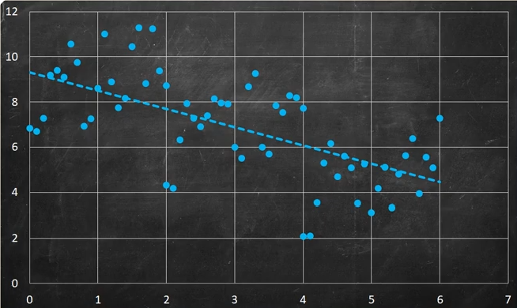
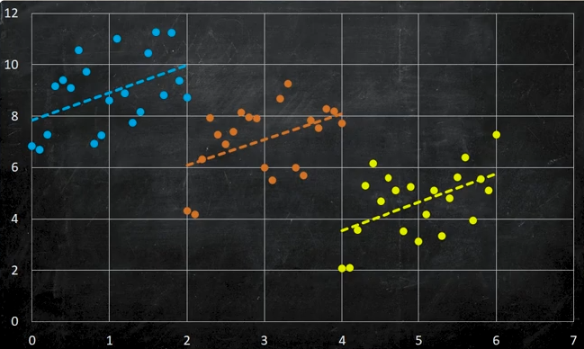

```{r setup, include=FALSE}
knitr::opts_chunk$set(echo = TRUE)
```

# Regression part 2 and logistics regression

Last week, we started on the topic of multivariate linear model. The two-hour lecture didn’t get us very far,
so in the fist half of this week’s lecture. We finally completed the topic of multivariate linear model and
moved into the area of classification problem.

There are several methods available for tackling classification problems. We begin by fitting a “linear” model
to a binary classification task (y is binary, e.g. Yes/No). I put “linear” in quotation marks because, technically,
we aren’t fitting a linear model in the strictest sense; rather, we’re fitting a logistic curve to the linear
combination of all predictors, such that


The logit function ensures that the output is constrained between 0 and 1. Similar to a multivariate linear
model, our goal with a given dataset is to estimate the value of $\beta$), calculate the variance of $\hat{\beta}$, assess the
model’s goodness of fit (note that $R^2$ is not applicable here!!), check underlying assumptions, and make
inferences. However, because many data scientists lack a background in statistics, these crucial steps are
often overlooked. Unfortunately to cover all these steps, it will take a few lectures, but if you are interested
in knowing “HOW to do these”, you may like to enrol in MA2405. In the scope of MA3405, we will focus on
model fitting and interpretation of output.

Logistics regression is a member of Generalized Linear Model (GLM), its parameters can be estimated using
the maximum likelihood approach. With the appropriate settings, the (glm) function in R will generate these
estimates.

In the last week’s tutorial, you fitted multivariate linear models to various regression problems. You used the
lm() function in R to find the estimated value of coefficients (i.e. $\beta$), determine variance of $\hat{\beta}$, calculated $R^2$ of the model, and make inference using the R output. This week, we will concentrate on interpreting model outputs, particularly when dealing with categorical predictors, verifying model assumptions and checking for
collinearity. We’ll conclude the tutorial by addressing a binary classification problem using logistic regression.

Discuss the following topics:

  - How can AIC, BIC and Mallow’s CP be used in linear model?
  
  \textcolor{red}{Akaike information criterion (AIC), Bayesian information criterion (BIC), Mallow's CP (adjusted $R^2$) are model selection criterias used to approximate test error.}

  - What do these criteria have in common? How do they differ?
  
  \textcolor{red}{As n -> $\infty$:}
  
  \textcolor{red}{  - BIC selects the correct model}
  
  \textcolor{red}{  - AIC tends to choose more complex model}
  
  \textcolor{red}{For finite samples:}
  
  \textcolor{red}{  - BIC tends to choose simple model due to heavy penality}
  
  - Explain how a categorical predictor (e.g with 3 levels) is coded in X matrix.
  
  \textcolor{red}{A categorical predictor is coded in using dummy variables that are binary. This means that if there are 3 levels in the categorical predictor, there will be 2 dummy variables to represent 2 of the levels (the first level is the baseline).}
  
  - If a predictor has three categories; explain why R only produces coefficients for two of those categories
  
  \textcolor{red}{The first category has no coeffecient as it is the baseline for the other 2 categories' coefficients.}
  
  - What is synergy effect?
  
  \textcolor{red}{The synergy effect also known as the interaction effect is when predictors are not independent and affect one another. For example, in marketing, the synergy between online and offline advertising might result in a higher sales increase than either method alone would generate. In other words, \textbf{it refers to the situation where the combined effect of two or more variables is greater than the sum of their individual effects.} Synergy implies that variables enhance each other's effect when combined. It can indicate that a specific combination of factors leads to better outcomes than expected if each factor were acting independently. The model requires an extra term to take into consideration the syngery effect.}
  
  - How can synergy effect be tested in linear model setting?
  
  \textcolor{red}{We use the p-values of the coefficients calculated from the summary() function in R. If the p-valus, is greater than its corresponding significance code (e.g. 0.05), the two predictors are correlated.}
  
  - What is collinearity?
  
  \textcolor{red}{Collinearity is when two or more predictors are correlated. For example, if two variables are correlated, it becomes difficult to distinguish the causal variable from the associated variable (a key assumption of a linear model is that the predictors are orthogonal/independent). This collinearity results in imprecise estimates of the regression coefficients ($\beta$ values).}
  
  - How can collinearity be tested?
  
  \textcolor{red}{1. A simple way to detect collinearity is to look at the \textbf{correlation matrix of the predictors}. An element of this matrix that is large in absolute value indicates a pair of highly correlated variables, and therefore a collinearity
problem in the data. Unfortunately, not all collinearity problems can be
detected by inspection of the correlation matrix: it is possible for collinear-
ity to exist between three or more variables even if no pair of variables
has a particularly high correlation. We call this situation multicollinearity.}

\textcolor{red}{2. Instead of inspecting the correlation matrix, a better way to assess multicollinearity is to compute the \textbf{variance inflation factor (VIF)}. The VIF is variance inflation factor the ratio of the variance of $\hat{\beta}_j$ when fitting the full model divided by the variance of $\hat{\beta}_j$ if fit on its own. The smallest possible value for VIF is 1, which indicates the complete absence of collinearity. Typically in practice there is a small amount of collinearity among the predictors. As a rule of
thumb, a VIF value that exceeds 5 or 10 indicates a problematic amount of
collinearity. The VIF for each variable can be computed using the formula:}


  - Difference between Synergy and Collinearity?
  
  \textcolor{red}{Collinearity refers to the statistical redundancy of variables, while synergy refers to an interaction where variables amplify each other's effects. Collinearity can complicate analysis due to redundancy, while synergy can enhance outcomes through collaboration.}
  
  - What is a odds ratio?
  
  \textcolor{red}{A statistic that quantifies the strength of the association between two events, A and B.}
  
  \[\text{odds ratio} = \frac{P(y = 1 | \text{Student})}{P(y = 1 | \text{Non-Student)}}\]
  
  \[\text{log odds ratio} = \log[\frac{P(y = 1 | \text{Student})}{P(y = 1 | \text{Non-Student)}}]\]
  
  - What is Simpson’s paradox?
  
  \textcolor{red}{Simpson's paradox occurs when a trend that appears in several different groups of data reverses when the data are combined into a single dataset.}
  
  
  
  
  
  \textcolor{red}{https://www.youtube.com/watch?v=t-Ci3FosqZs}
  
  \textcolor{red}{https://www.youtube.com/watch?v=bArPxj5xhso}
  
  
## Exercises - Part 1

### Question 1:

Suppose we have a data set with five predictors, $X_1$ = GPA, $X_2$ = IQ, $X_3$ = Level (three levels, postgraduate,
college, high school ), $X_4$ = Interaction between GPA and IQ, and $X_5$ = Interaction between GPA and Level.
The response is starting salary after graduation (in thousands of dollars).
Suppose we use least squares to fit the model, and get $\hat{\beta}_0$ = 50, $\hat{\beta}_{GPA}$ = 20, $\hat{\beta}_{IQ}$ = 0.07, $\hat{\beta}_{college}$ =
35, $\hat{\beta}_{postgraduate}$ = 50, $\hat{\beta}_{GPA:IQ}$ = 0.01, $\hat{\beta}_{GPA:college}$ = -10 and $\hat{\beta}_{GPA:postgraduate}$ = -11

Using the result above,

  1. Specify the predictive model used to predict the starting salary of High school graduate
  
  \textcolor{red}{$y_{highschool} = \hat{\beta}_0 + \hat{\beta}_{GPA}X_1 + \hat{\beta}_{IQ}X_2 + \hat{\beta}_{GPA:IQ}X_4$}
  
  2. Specify the predictive model used to predict the starting salary of College graduate
  
  \textcolor{red}{$y_{college} = \hat{\beta}_0 + \hat{\beta}_{GPA}X_1 + \hat{\beta}_{IQ}X_2 + \hat{\beta}_{college}X_3 + \hat{\beta}_{GPA:IQ}X_4 + \hat{\beta}_{GPA:college}X_5$}
  
  3. Specify the predictive model used to predict the starting salary for individuals with postgraduate degree
  
  \textcolor{red}{$y_{postgraduate} = \hat{\beta}_0 + \hat{\beta}_{GPA}X_1 + \hat{\beta}_{IQ}X_2 + \hat{\beta}_{postgraduate}X_3 + \hat{\beta}_{GPA:IQ}X_4 + \hat{\beta}_{GPA:postgraduate}X_5$}
  
  4. If the p-value for $\hat{\beta}_{GPA:college}$ is less than 0.05, what does it implies?
  
  \textcolor{red}{This implies that there is no significant difference between three levels for GPA. In other words, there is very little interaction between GPA and Level.}

### Question 2:

Last week, in Exercise 9(d), you used the plot function to produce diagnostic plots of the linear model. Four
figures were produced using this function. Explain which assumption each of these figures is designed to
assess.

### Question 3:

Exercise 14, Chapter 3.7
