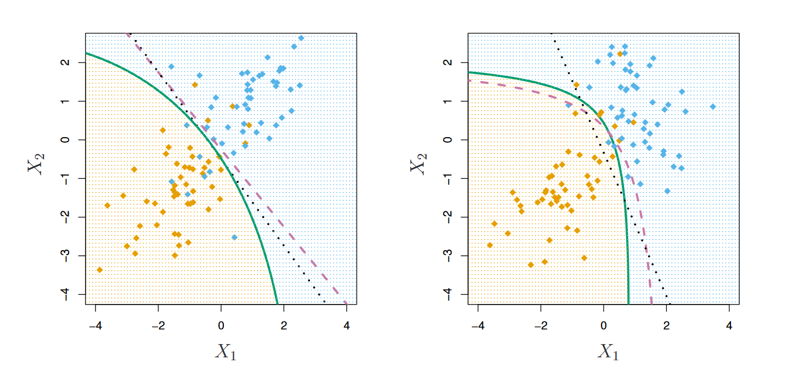
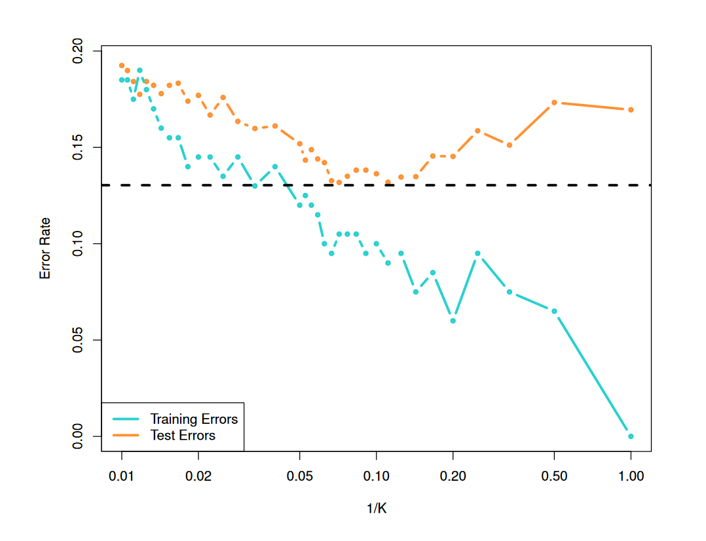

```{r setup, include=FALSE}
knitr::opts_chunk$set(echo = TRUE)
```

# LDA, QDA, Naive Bayes and KNN

Suppose an anesthetist needs to determine whether an anesthetic is safe for a patient who is having a
heart operation. The anesthesiologist may know certain things about this patient such as their age, gender,
race, blood pressure and weight. Based on these kinds of data, the anesthesiologist would like to identify
if the patient is safe or unsafe for anesthetic. This is a classification problem, we can employ one of many
Classification methods for this. Last week, we started on logistic regression, this week we explore the
use of Linear discriminant analysis (LDA), quadratic discriminant analysis (QDA) and K nearest approach
(KNN).

Both LDA and QDA are based on the Gaussian mixture model framework, which assumes that the data is a
mixture of K normal distributions, where K is the number of components. The probability of xi belong to
component k is,


where $\pi_k$ is the “weight” of the component and fk() is a Gaussian distribution with mean of $\mu_k$ and variance
$\sigma_k$.

The key difference between LDA and QDA is in the variance term. In LDA, it assumes variance is the same
for all classes (or components) while QDA allows covariance matrix to vary between classes (i.e. k). This
makes the boundaries (discriminant function) between classes more flexible (in quadratic form).

The discriminant function for LDA is


and QDA


Here is just a snapshot of what we covered in the lecture. Now, it’s your turn to work through the questions
below in Group Two.

Discuss the following topics:

  - Explain how LDA, QDA, Naive Bayes and KNN work
  
  \textcolor{red}{These are classification methods.}
  
  \textcolor{red}{LDA and QDA use Gaussian Maximum Likelihood Classification, where they look at the probability of an observation being in one class or another (each class has a Multivariate Gaussian (Normal) Distribution). For LDA it is assumes that all classes have the same covariance.} 
  
  \textcolor{red}{} 
  
  \textcolor{red}{https://www.youtube.com/watch?v=IMfLXEOksGc}

  - What are the Key assumption behind LDA?
  
  \textcolor{red}{It assumes all classes have the same covariance matrix ($\sum_1 = \sum_2 = ... = \sum_k$).}
  
  - What are the key difference between LDA and QDA?
  
  \textcolor{red}{LDA assumes all classes have the same covariance matrix ($\sum_1 = \sum_2$) while QDA uses class-specific covariance matrices ($\sum_1 \neq \sum_2$). The decision boundaries between classes are linear for LDA, but quadratic (curved) for QDA:}
  
  
  left: $\sum_1 = \sum_2$
  
  right: $\sum_1 \neq \sum_2$
  
  where:
  
  \textcolor{Green}{  - Green - QDA}
  
  \textcolor{black}{  - black dotted - LDA}
  
  \textcolor{Mulberry}{  - purple - Naive Bayes}
  
  
  - Why does QDA use class-specific covariance matrices?
  
  \textcolor{red}{QDA uses class-specific covariance matrices to model the variability of data within each class more accurately. This flexibility is useful when the assumption of equal covariance matrices (as in LDA) is not valid.}
  
  - When would LDA be a better choice than QDA?
  
  \textcolor{red}{When the assumption of covariance matrices being equal ($\sum_1 = \sum_2$) is valid.}
  
  - What challenges might arise when using QDA with high-dimensional data?
  
   \textcolor{red}{QDA is computationally expensive when K (no of classes) and P (no of predictors) are large.}
  
  - What does k represent in K-nearest neighbor (KNN)?
  
  \textcolor{red}{"K" is not number of classes, but the number of "neighboring
points" to be considered.}
  
  - How does the choice of k affect the performance of the KNN algorithm?
  
  \textcolor{red}{ - A small K (e.g. K=1) is too flexible resulting in low bias but high variance.}
  
  \textcolor{red}{ - As K increases, bias increases but variance decreases.}
  
  \textcolor{red}{Trade-off between BIAS and VARIANCE.}
  
  - How would you choose an optimal value for k in KNN?
  
  \textcolor{red}{ 1. Split data into training and test sets}
  
  \textcolor{red}{ 2. Use test set to find the optimal K}
  
  
  
  - Can KNN be used for regression tasks, and if so, how?
  
  \textcolor{red}{Yes, KNN be used for regression tasks. It is like a moving average, where it takes the average of the K closest obeservations. This means that the average of the those obeservations will serve for prediction.}

## Labs - Classification Methods

### 4.7.1 The Stock Market Data

We will begin by examining some numerical and graphical summaries of
the Smarket data, which is part of the ISLR2 library. This data set consists of
percentage returns for the S&P 500 stock index over 1, 250 days, from the
beginning of 2001 until the end of 2005. For each date, we have recorded
the percentage returns for each of the five previous trading days, Lag1
through Lag5. We have also recorded Volume (the number of shares traded
on the previous day, in billions), Today (the percentage return on the date
in question) and Direction (whether the market was Up or Down on this
date). Our goal is to predict Direction (a qualitative response) using the
other features.

```{r}
library(ISLR2)
names(Smarket)
dim(Smarket)
summary(Smarket)
pairs(Smarket)
```

The cor() function produces a matrix that contains all of the pairwise
correlations among the predictors in a data set. The first command below
gives an error message because the Direction variable is qualitative.

```{r}
# cor(Smarket) results in "Error in cor(Smarket) : 'x' must be numeric"
cor(Smarket[, -9])
```
As one would expect, the correlations between the lag variables and to-
day’s returns are close to zero. In other words, there appears to be little
correlation between today’s returns and previous days’ returns. The only
substantial correlation is between Year and Volume. By plotting the data,
which is ordered chronologically, we see that Volume is increasing over time.
In other words, the average number of shares traded daily increased from
2001 to 2005.

```{r}
attach(Smarket)
plot(Volume)
```
### 4.7.2 Logistic Regression

Next, we will fit a logistic regression model in order to predict Direction
using Lag1 through Lag5 and Volume. The glm() function can be used to fit glm()
many types of generalized linear models, including logistic regression. The generalized
linear modelsyntax of the glm() function is similar to that of lm(), except that we must
pass in the argument family = binomial in order to tell R to run a logistic
regression rather than some other type of generalized linear model.

```{r}
glm.fits <- glm(Direction ~ Lag1 + Lag2 + Lag3 + Lag4 + Lag5 + Volume, data = Smarket , family = binomial)
summary(glm.fits)
```

The smallest p-value here is associated with Lag1. The negative coefficient
for this predictor suggests that if the market had a positive return yesterday,
then it is less likely to go up today. However, at a value of 0.15, the p-value
is still relatively large, and so there is no clear evidence of a real association
between Lag1 and Direction.
We use the coef() function in order to access just the coefficients for this
fitted model. We can also use the summary() function to access particular
aspects of the fitted model, such as the p-values for the coefficients.

```{r}
coef(glm.fits)
summary(glm.fits)$coef
summary(glm.fits)$coef[, 4]
```

The predict() function can be used to predict the probability that the
market will go up, given values of the predictors. The type = "response"
option tells R to output probabilities of the form P (Y = 1|X), as opposed
to other information such as the logit. If no data set is supplied to the
predict() function, then the probabilities are computed for the training
data that was used to fit the logistic regression model. Here we have printed
only the first ten probabilities. We know that these values correspond to
the probability of the market going up, rather than down, because the
contrasts() function indicates that R has created a dummy variable with
a 1 for Up.

```{r}
glm.probs <- predict(glm.fits , type = "response")
glm.probs [1:10]
contrasts(Direction)
```

In order to make a prediction as to whether the market will go up or
down on a particular day, we must convert these predicted probabilities
into class labels, Up or Down. The following two commands create a vector
of class predictions based on whether the predicted probability of a market
increase is greater than or less than 0.5.

```{r}
glm.pred <- rep("Down", 1250)
glm.pred[glm.probs > .5] = "Up"
```

The first command creates a vector of 1,250 Down elements. The second line
transforms to Up all of the elements for which the predicted probability of a
market increase exceeds 0.5. Given these predictions, the table() function table()
can be used to produce a confusion matrix in order to determine how many
observations were correctly or incorrectly classified.

```{r}
table(glm.pred , Direction )
(507 + 145) / 1250
mean(glm.pred == Direction)
```

The diagonal elements of the confusion matrix indicate correct predictions,
while the off-diagonals represent incorrect predictions. Hence our model
correctly predicted that the market would go up on 507 days and that
it would go down on 145 days, for a total of 507 + 145 = 652 correct
predictions. The mean() function can be used to compute the fraction of
days for which the prediction was correct. In this case, logistic regression
correctly predicted the movement of the market 52.2 % of the time.

At first glance, it appears that the logistic regression model is working
a little better than random guessing. However, this result is misleading
4.7 Lab: Classification Methods 175
because we trained and tested the model on the same set of 1, 250 ob-
servations. In other words, 100% - 52.2% = 47.8%, is the training error
rate. As we have seen previously, the training error rate is often overly
optimistic—it tends to underestimate the test error rate. In order to better
assess the accuracy of the logistic regression model in this setting, we can
fit the model using part of the data, and then examine how well it predicts
the held out data. This will yield a more realistic error rate, in the sense
that in practice we will be interested in our model’s performance not on
the data that we used to fit the model, but rather on days in the future for
which the market’s movements are unknown.
To implement this strategy, we will first create a vector corresponding
to the observations from 2001 through 2004. We will then use this vector
to create a held out data set of observations from 2005.

```{r}
train <- (Year < 2005)
Smarket.2005 <- Smarket [!train , ]
dim(Smarket.2005)
Direction.2005 <- Direction [! train]
```

The object train is a vector of 1,250 elements, corresponding to the ob-
servations in our data set. The elements of the vector that correspond to
observations that occurred before 2005 are set to TRUE, whereas those that
correspond to observations in 2005 are set to FALSE. The object train is a
Boolean vector, since its elements are TRUE and FALSE. Boolean vectors can boolean
be used to obtain a subset of the rows or columns of a matrix. For instance,
the command Smarket[train, ] would pick out a submatrix of the stock
market data set, corresponding only to the dates before 2005, since those
are the ones for which the elements of train are TRUE. The ! symbol can be
used to reverse all of the elements of a Boolean vector. That is, !train is
a vector similar to train, except that the elements that are TRUE in train
get swapped to FALSE in !train, and the elements that are FALSE in train
get swapped to TRUE in !train. Therefore, Smarket[!train, ] yields a sub-
matrix of the stock market data containing only the observations for which
train is FALSE—that is, the observations with dates in 2005. The output
above indicates that there are 252 such observations.
We now fit a logistic regression model using only the subset of the obser-
vations that correspond to dates before 2005, using the subset argument.
We then obtain predicted probabilities of the stock market going up for
each of the days in our test set—that is, for the days in 2005.

```{r}
glm.fits <- glm(Direction ~ Lag1 + Lag2 + Lag3 + Lag4 + Lag5 + Volume ,
data = Smarket , family = binomial , subset = train)
glm.probs <- predict(glm.fits, Smarket.2005, type = "response")
```

Notice that we have trained and tested our model on two completely sep-
arate data sets: training was performed using only the dates before 2005,
and testing was performed using only the dates in 2005. Finally, we compute 
the predictions for 2005 and compare them to the actual movements
of the market over that time period.

```{r}
glm.pred <- rep("Down", 252)
glm.pred[glm.probs > .5] <- "Up"
table(glm.pred , Direction.2005)
mean(glm.pred == Direction.2005)
mean(glm.pred != Direction.2005)
```
The != notation means not equal to, and so the last command computes
the test set error rate. The results are rather disappointing: the test error
rate is 52 %, which is worse than random guessing! Of course this result
is not all that surprising, given that one would not generally expect to be
able to use previous days’ returns to predict future market performance.
(After all, if it were possible to do so, then the authors of this book would
be out striking it rich rather than writing a statistics textbook.)
We recall that the logistic regression model had very underwhelming p-
values associated with all of the predictors, and that the smallest p-value,
though not very small, corresponded to Lag1. Perhaps by removing the
variables that appear not to be helpful in predicting Direction, we can
obtain a more effective model. After all, using predictors that have no
relationship with the response tends to cause a deterioration in the test
error rate (since such predictors cause an increase in variance without a
corresponding decrease in bias), and so removing such predictors may in
turn yield an improvement. Below we have refit the logistic regression using
just Lag1 and Lag2, which seemed to have the highest predictive power in
the original logistic regression model.

```{r}
glm.fits <- glm(Direction ~ Lag1 + Lag2 , data = Smarket, family = binomial , subset = train)
glm.probs <- predict(glm.fits , Smarket.2005 , type = "response")
glm.pred <- rep("Down", 252)
glm.pred[glm.probs > .5] <- "Up"
table(glm.pred , Direction.2005)
mean(glm.pred == Direction.2005)
106 / (106 + 76)
```
Now the results appear to be a little better: 56% of the daily movements
have been correctly predicted. It is worth noting that in this case, a much
4.7 Lab: Classification Methods 177
simpler strategy of predicting that the market will increase every day will
also be correct 56% of the time! Hence, in terms of overall error rate, the
logistic regression method is no better than the naive approach. However,
the confusion matrix shows that on days when logistic regression predicts
an increase in the market, it has a 58% accuracy rate. This suggests a
possible trading strategy of buying on days when the model predicts an in-
creasing market, and avoiding trades on days when a decrease is predicted.
Of course one would need to investigate more carefully whether this small
improvement was real or just due to random chance.
Suppose that we want to predict the returns associated with particular
values of Lag1 and Lag2. In particular, we want to predict Direction on a
day when Lag1 and Lag2 equal 1.2 and 1.1, respectively, and on a day when
they equal 1.5 and -0.8. We do this using the predict() function.

```{r}
predict(glm.fits , newdata = data.frame(Lag1 = c(1.2, 1.5), Lag2 = c(1.1, -0.8)), type = "response")
```

### 4.7.3 Linear Discriminant Analysis

Now we will perform LDA on the Smarket data. In R, we fit an LDA model
using the lda() function, which is part of the MASS library. Notice that the lda()
syntax for the lda() function is identical to that of lm(), and to that of
glm() except for the absence of the family option. We fit the model using
only the observations before 2005.

```{r}
library(MASS)
lda.fit <- lda(Direction ~ Lag1 + Lag2, data = Smarket, subset = train)
lda.fit
plot(lda.fit)
```

The LDA output indicates that $\hat{\pi}_1$ = 0.492 and $\hat{\pi}_2$ = 0.508; in other words,
49.2 % of the training observations correspond to days during which the
market went down. It also provides the group means; these are the average
of each predictor within each class, and are used by LDA as estimates of
$\mu_k$. These suggest that there is a tendency for the previous 2 days’ returns
to be negative on days when the market increases, and a tendency for the
previous days’ returns to be positive on days when the market declines. The
coefficients of linear discriminants output provides the linear combination
of Lag1 and Lag2 that are used to form the LDA decision rule. In other
words, these are the multipliers of the elements of X = x in (4.24). If
-0.642 × Lag1-0.514 × Lag2 is large, then the LDA classifier will predict a
market increase, and if it is small, then the LDA classifier will predict a
market decline.
The plot() function produces plots of the linear discriminants, obtained
by computing -0.642 × Lag1-0.514 × Lag2 for each of the training obser-
vations. The Up and Down observations are displayed separately.
The predict() function returns a list with three elements. The first ele-
ment, class, contains LDA’s predictions about the movement of the mar-
ket. The second element, posterior, is a matrix whose kth column contains
the posterior probability that the corresponding observation belongs to the
kth class, computed from (4.15). Finally, x contains the linear discrimi-
nants, described earlier.

```{r}
lda.pred <- predict(lda.fit , Smarket.2005)
names(lda.pred)
```


As we observed in Section 4.5, the LDA and logistic regression predictions
are almost identical.

```{r}
lda.class <- lda.pred$class
table(lda.class , Direction.2005)
mean(lda.class == Direction.2005)
```

Applying a 50 % threshold to the posterior probabilities allows us to recreate 
the predictions contained in lda.pred$class.

```{r}
sum(lda.pred$posterior[, 1] >= .5)
sum(lda.pred$posterior[, 1] < .5)
```

Notice that the posterior probability output by the model corresponds to
the probability that the market will decrease:

```{r}
lda.pred$posterior [1:20 , 1]
lda.class [1:20]
```

If we wanted to use a posterior probability threshold other than 50 % in
order to make predictions, then we could easily do so. For instance, suppose
that we wish to predict a market decrease only if we are very certain that the
market will indeed decrease on that day—say, if the posterior probability
is at least 90 %.

```{r}
sum(lda.pred$posterior[, 1] > .9)
```

No days in 2005 meet that threshold! In fact, the greatest posterior prob-
ability of decrease in all of 2005 was 52.02 %.